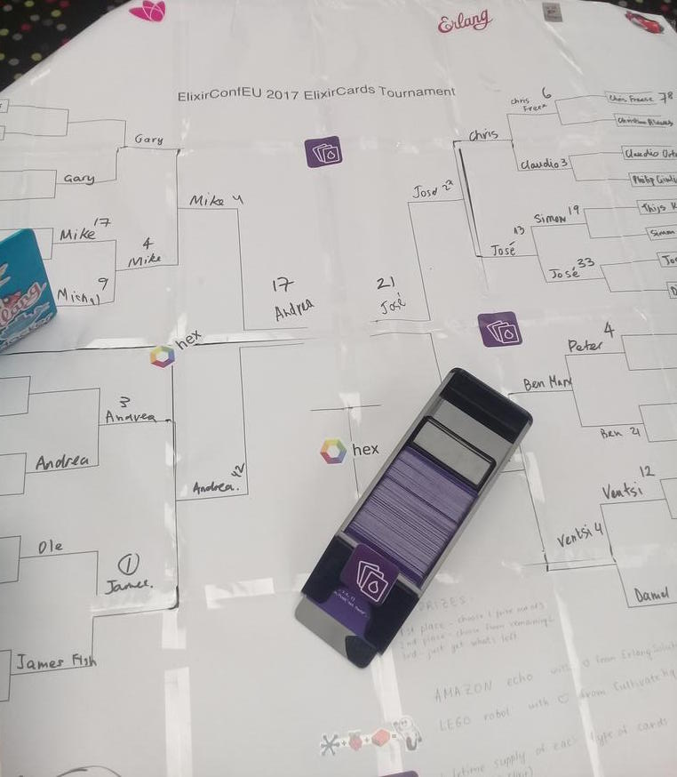

# Flashcards Tournament



Tournament is suitable for competitive individuals who know the language fairly well.

## How to play

We need tournament table and timer.

1. Set timer for 1 minute.
2. Place a deck of cards in front of you.
3. When ready start timer and try to answer as many cards as you can in 1 minute.
4. Once minute is up, count number of correct, wrong, skipped cards.
5. Calculate your score using this formula:
```
correct_answers_count * 3 - wrong_answers_count * 2 - skipped
```
6. Add your name and score to the tournament table

## Winner
Winner would made it to the top of the tournament table.
